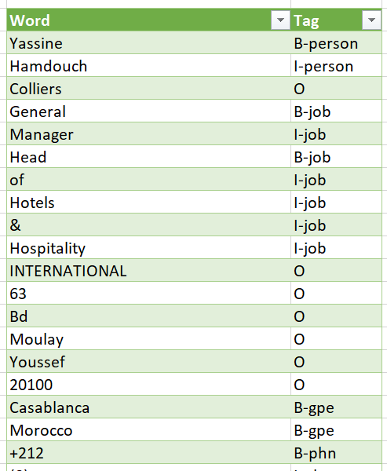
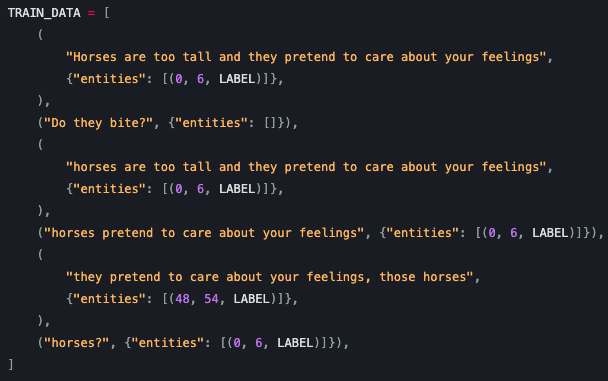

# Named-Entity-Recoginition-on-Biz-Cards-using-Spacy

## Requirements

* google.cloud==0.34.0
* plac==0.9.6
* pandas==0.23.4
* spacy==2.1.4

We'll also need create a project on Google Cloud and enable the vision AI API and then create a credential and download the credentials JSON file, saved it as CREDENTIALS.json.

## Dataset

“images” folder containing 78 images of scanned business cards in png format.

## Data preparation:

First, we need to extract text from the images using Google Cloud Platform OCR and save the extracted text from each image in an individual txt file in the “extracted_text” folder. (png_to_txt.ipynb)
Splitting the individual txt files into train and test is done manually.

Next, we need to convert these txt files into 2 csv files (train and test), each containing 2 columns:

* Word: where each individual word is stored;
* Tag: where the entity is specified using a BIO type tagging.

The csv file should look like this:



Note that between two business cards, there is always a dot separating them.
The labelling is done manually directly into the csv file.
SpaCy requires the training data to be in the following format:



So, we have to convert our data which is in .csv format to the above format. We first convert the .csv file to .tsv file. Next, we run tsv_to_json.py to get the training data in. json format.
The next step is to convert the json file into the format needed by spaCy. It can be done by running
```
python json_to_spacy.py -i=train_dataset_BIO.py -o=train_dataset_BIO
```
in the command prompt.

## Training

Training can be done either by updating over a pre-trained model or creating a new one from scratch.
In our case, training corresponds to updating the english pre-trained Named Entity Recognizer with our own words from the business cards. When updating, we can even add new entities.
The labels we have in our case are:

*	ORG: companies, agencies, etc.
*	PERSON: person’s first and last name.
*	EML: e-mail address.
*	WEB: website
*	PHN: phone number
*	GPE: countries, cities, etc.
*	JOB: job titles.

The training is done by running the command:

```
python ner_training.py -m=en -nm=<new model name> -o=Output/Directory -n=<number of iterations>
```

In our case, we used 600 steps in the training.

## Model evaluation

We evaluate the model by calculating precision, recall and f1-score for each one of the labels we have. 

```
              precision    recall  f1-score   support

       B-eml       0.92      0.73      0.81        15
       B-gpe       0.73      0.65      0.69        17
       B-job       0.67      0.57      0.62        14
       B-org       0.80      0.63      0.71        19
    B-person       1.00      0.47      0.64        15
       B-phn       0.83      0.50      0.62        30
       B-web       1.00      0.67      0.80         9
       I-eml       0.00      0.00      0.00         4
       I-gpe       1.00      0.75      0.86         8
       I-job       0.50      0.36      0.42        22
       I-org       0.45      0.51      0.48        39
    I-person       0.80      0.42      0.55        19
       I-phn       0.90      0.89      0.90        64
           O       0.76      0.90      0.83       284
         nan       0.00      0.00      0.00         1

   micro avg       0.76      0.76      0.76       560
   macro avg       0.69      0.54      0.59       560
weighted avg       0.76      0.76      0.75       560
```

such as :


### Difference between Micro and Macro average

In a multi-class classification problem, a macro-average will compute the metric independently for each class and then take the average (hence treating all classes equally), whereas a micro-average will aggregate the contributions of all classes to compute the average metric. In our case, micro-average is preferable.
